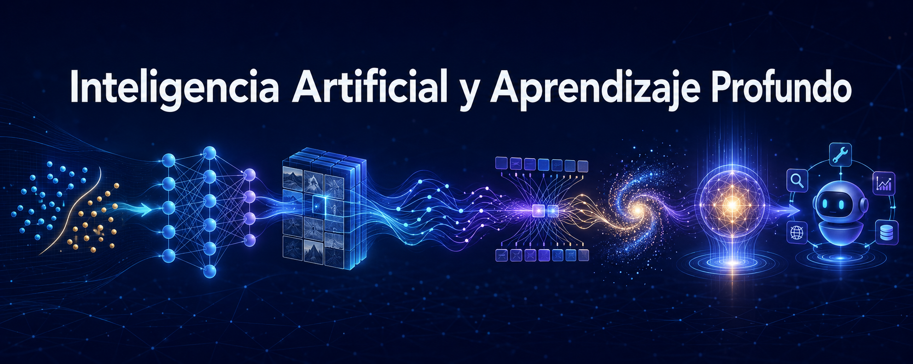

# Inteligencia Artificial y Aprendizaje Automático

---

**Fecha:** 1 de septiembre al 6 de octubre de 2026

**Responsable:** Dr. Ulises Olivares Pinto  

## Objetivo General
Desarrollar una comprensión profunda y aplicada de los principios y técnicas fundamentales de la inteligencia artificial y el aprendizaje profundo, capacitando a los participantes para diseñar, implementar y evaluar soluciones avanzadas en diversos contextos y problemas reales.

## Objetivos Específicos
- Entender los principios fundamentales de la IA y el aprendizaje profundo.
- Dominar el uso de redes neuronales en aplicaciones prácticas.
- Aplicar aprendizaje profundo a la visión por computadora y al NLP.
- Experimentar con la creación de datos mediante modelado generativo.
- Implementar aprendizaje por refuerzo para la toma de decisiones autónoma.
- Completar proyectos que integren teoría y práctica de IA.
- Seguir las tendencias actuales y emergentes en IA.
- Considerar la ética en el desarrollo y aplicación de la IA.

## **Modalidad:** 
>Presencial  
## **Prerrequisitos:** 
+ Computadora personal con acceso a internet
+ Cuenta de Gmail
+ Conocimientos básicos de programación.

## Temario

# Inteligencia Artificial y Aprendizaje Automático

| Sesiones | Tema | Contenidos principales | Material de consulta | Ejercicios y demostraciones | Presentación |
|---|---|---|---|---|---|
| Sesión 1 | Introducción a la IA y al aprendizaje profundo | IA, ML y deep learning Historia y fundamentos Aplicaciones actuales | [Artificial Intelligence: A Modern Approach](https://www.amazon.com/Artificial-Intelligence-Modern-Approach-3rd/dp/0136042597) | • [Modelado generativo](https://colab.research.google.com/drive/1Ez5nMk_kCHwpTSlpbFmfAf9DIZNtCt55?usp=sharing) • [Detección con YOLO](https://colab.research.google.com/drive/1qZAGVPkwuYIXWD4T0oWYu6rVBTLlkQ9F?usp=sharing) | [Sesión 1](pdf/Sesión%201.pdf) |
| Sesión 2 | Fundamentos del aprendizaje automático clásico | Aprendizaje supervisado y no supervisado Entrenamiento, validación y prueba Clasificación, regresión y agrupamiento Generalización y evaluación | [An Introduction to Statistical Learning](https://www.statlearning.com/) | [Código de la sesión 2](https://colab.research.google.com/drive/11WNyJai7ruNoPYL0RBDzrhaGdpq2IcPM?usp=sharing) | [Sesión 2](pdf/Sesión%202.pdf) |
| Sesión 3 | Análisis exploratorio de datos | Exploración y calidad de datos Estadística descriptiva y visualización Limpieza e interpretación YData Profiling | Material práctico del curso | [Código: análisis exploratorio](https://colab.research.google.com/drive/1ZN49k-uidlvTC2paM81EAp-A2GIBzrjg?usp=sharing) | |
| Sesión 4 | Modelos sencillos de regresión y clasificación | Regresión lineal y logística Entrenamiento y predicción Métricas de evaluación Interpretación y comparación de modelos | [An Introduction to Statistical Learning](https://www.statlearning.com/) | [Código: regresión y clasificación](https://colab.research.google.com/drive/1NIeBeq_kZfxV4bd2g7Mr64ZR5JFd8zm-?usp=sharing) | |
| Sesión 5 | Fundamentos de redes neuronales | Perceptrón y MLP Activaciones y propagación Pérdida y optimización Sobreajuste y generalización | [Deep Learning](https://www.deeplearningbook.org/) | • [Demo 1](https://colab.research.google.com/drive/1DOIYUdy-4aPgvrtt-ZuAkZSqqptotPC2?usp=sharing) • [Demo 2](https://colab.research.google.com/drive/1DOIYUdy-4aPgvrtt-ZuAkZSqqptotPC2?usp=sharing) | [Sesión 5](pdf/Sesión%205.pdf) |
| Sesión 6 | Redes neuronales convolucionales (CNN) | Convolución y extracción de características Arquitecturas CNN Aumento y regularización Clasificación y transferencia de aprendizaje | [CS231n: Convolutional Neural Networks](http://cs231n.stanford.edu/) | | |
| Sesión 7 | RNN, LSTM y BiLSTM | Modelado de secuencias RNN, LSTM y BiLSTM Texto y series temporales Partición temporal y fugas de información | [Understanding LSTM Networks](http://colah.github.io/posts/2015-08-Understanding-LSTMs/) | | |
| Sesión 8 | Transformers y mecanismos de atención | Atención y autoatención Codificación posicional Arquitectura Transformer Comparación con redes recurrentes | [Attention Is All You Need](https://arxiv.org/abs/1706.03762) | | |
| Sesión 9 | Introducción al modelado generativo | Modelos discriminativos y generativos Espacio latente y autoencoders GANs Modelos de difusión | [Deep Generative Modeling](https://link.springer.com/book/10.1007/978-3-031-05728-6) | | |
| Sesión 10 | Modelos grandes de lenguaje (LLM) y aplicaciones | Tokenización y representaciones Preentrenamiento y ajuste fino Prompting y RAG Evaluación y uso responsable | [Natural Language Processing with Transformers](https://www.oreilly.com/library/view/natural-language-processing/9781098136789/) | | |
| Sesión 11 | Agentes de inteligencia artificial | Arquitectura de agentes Razonamiento, planificación y acción Memoria y herramientas Sistemas multiagente | | | |
| Sesión 12 | Desarrollo y presentación de proyectos | Definición del problema Datos y selección de modelos Implementación y evaluación Presentación y retroalimentación | | | |
#### Última modificación: 17 de septiembre de 2026
